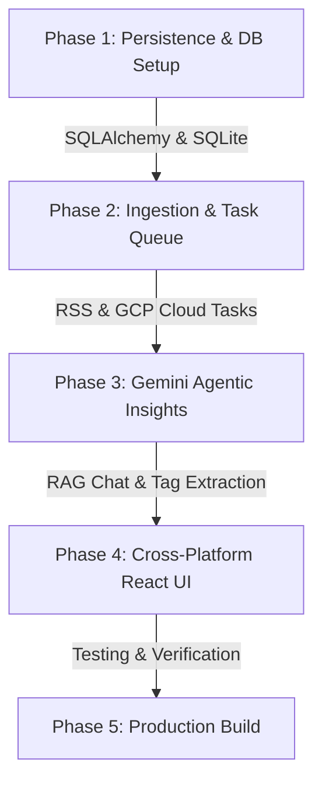

# TunedIn - AI-Powered Podcast Curation & Knowledge Web & Mobile App

## 1. Executive Summary & Vision
**TunedIn** is an intelligent, cross-platform podcast application that automates RSS feed ingestion, analyzes audio content using AI agents to extract structured insights and tags, queues background processing using **Google Cloud Tasks**, and empowers users to converse with an AI assistant to discover content and build personalized, curated playlists.

---

## 2. Key Architecture & Design Decisions

- **Backend Framework**: Python (FastAPI) async web service ([backend/PLAN.md](file:///home/chesd/dev/tunedin/backend/PLAN.md)).
- **Database Abstraction**: SQLAlchemy 2.0 Async ORM defaulting to **SQLite** (`sqlite+aiosqlite`) for dev/testing, swappable to PostgreSQL/Cloud SQL ([backend/persistence/PLAN.md](file:///home/chesd/dev/tunedin/backend/persistence/PLAN.md)).
- **Task Queue Service**: Managed **Google Cloud Tasks** queue abstraction (`GCPCloudTasksDriver` with `LocalInMemoryDriver` fallback) ([backend/ingestion/PLAN.md](file:///home/chesd/dev/tunedin/backend/ingestion/PLAN.md)).
- **AI Agentic Insights**: Google Gemini API (`GeminiAgentProvider` with fallback `MockAgentProvider`) ([backend/insights/PLAN.md](file:///home/chesd/dev/tunedin/backend/insights/PLAN.md)).
- **Cross-Platform Frontend**: React (Vite + Vanilla CSS) built with decoupled custom hooks and platform-agnostic state for seamless expansion to **React Native / Expo** ([frontend/PLAN.md](file:///home/chesd/dev/tunedin/frontend/PLAN.md)).

---

## 3. Modular Technical Implementation Plans

The technical implementation plan is organized into a modular directory hierarchy:

1. ⚙️ **Backend Master Plan**: [backend/PLAN.md](file:///home/chesd/dev/tunedin/backend/PLAN.md)
   - 🗄️ **Persistence Layer Sub-Plan**: [backend/persistence/PLAN.md](file:///home/chesd/dev/tunedin/backend/persistence/PLAN.md)
   - 📥 **Feed Ingestion & Task Queue Sub-Plan**: [backend/ingestion/PLAN.md](file:///home/chesd/dev/tunedin/backend/ingestion/PLAN.md)
   - 🤖 **Agentic Insights & AI Curation Sub-Plan**: [backend/insights/PLAN.md](file:///home/chesd/dev/tunedin/backend/insights/PLAN.md)

2. 🎨 **Frontend Technical Plan**: [frontend/PLAN.md](file:///home/chesd/dev/tunedin/frontend/PLAN.md)

---

## 4. Overall Implementation Roadmap

---

## 5. Verification Strategy
- **Backend Tests**: `pytest` backend test suite with in-memory SQLite and local task queue.
- **Frontend Tests**: `npm run build` static analysis and responsive layout validation.
