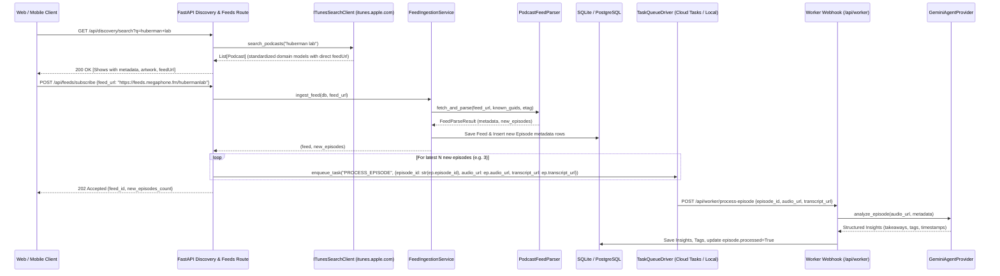

# TunedIn Backend - Feed Ingestion & Apple Podcasts (iTunes) Discovery Plan

## 1. Overview
The **Feed Ingestion & Discovery Sub-System** provides podcast discovery, rich metadata extraction, incremental RSS synchronization, and task queue dispatching without downloading or storing media files locally:
1. **Podcast Discovery via Apple Podcasts (iTunes Search API)**: Query the public iTunes Search & Lookup API (`https://itunes.apple.com`) to search podcasts, look up shows by Apple collection ID, and discover top shows—**with zero API keys or authentication requirements**.
2. **Direct RSS Extraction**: Extract the canonical publisher RSS feed URL (`feedUrl`) directly from iTunes search results, bridging discovery directly into the standard RSS ingestion pipeline.
3. **Metadata Normalization & Ingestion**: Normalize discovery results and RSS feeds into standard provider-agnostic domain dataclasses (`Podcast`, `PodcastSearchResult`, `ParsedFeedMetadata`, `ParsedEpisode`, `FeedParseResult`).
4. **Incremental RSS Synchronization**: Maintain up-to-date feeds using HTTP conditional caching (`ETag`, `Last-Modified` / HTTP 304) and incremental episode deduplication (`known_guids`, `last_updated_at`).
5. **Database Persistence**: Synchronize feeds and episodes directly into SQLAlchemy ORM models (`Feed`, `Episode`), storing media enclosure URLs (`audio_url`), timestamps, shownotes, and transcript links for downstream use.
6. **Task Queuing**: Enqueue lightweight background processing tasks (`PROCESS_EPISODE`) containing episode references and remote metadata for downstream AI insight extraction.

---

## 2. Architecture & Data Structures

```
                      ┌─────────────────────────────────────────┐
                      │    Apple Podcasts (iTunes Search API)   │
                      │   (Search, Lookup, Top Charts - No Key) │
                      └────────────────────┬────────────────────┘
                                           │
                                           ▼
┌──────────────────────┐      ┌─────────────────────────┐      ┌──────────────────────┐
│  Web/Mobile Client   ├─────►│    ITunesSearchClient   ├─────►│       Podcast /      │
│  (Discovery & Sub)   │      │  (Zero-Auth, HTTPX)     │      │ PodcastSearchResult  │
└──────────┬───────────┘      └────────────┬────────────┘      └──────────────────────┘
           │                               │ (feedUrl -> Direct RSS Endpoint)
           │                               ▼
           │                  ┌─────────────────────────┐      ┌──────────────────────┐
           │                  │   PodcastFeedParser     ├─────►│   FeedParseResult    │
           │                  │  (Incremental RSS XML)  │      │  (Metadata+Episodes) │
           │                  └────────────┬────────────┘      └──────────────────────┘
           │                               │
           ▼                               ▼
┌───────────────────────────────────────────────────────┐
│              FeedIngestionService                     │
│    (Syncs Metadata, Feeds & Episodes into SQLite/DB)  │
└──────────────────────────┬────────────────────────────┘
                           │
                           ▼
┌───────────────────────────────────────────────────────┐
│         TaskQueueDriver (Cloud Tasks / Local)         │
│     Enqueues PROCESS_EPISODE {episode_id, audio_url}  │
└──────────────────────────┬────────────────────────────┘
                           │
                           ▼
┌───────────────────────────────────────────────────────┐
│            AI Worker (Gemini Insights)                │
│    Processes audio via URL or metadata transcript     │
└───────────────────────────────────────────────────────┘
```

### A. Discovery Data Models ([`backend/ingestion/models.py`](file:///home/xing808/dev/tunedin/backend/ingestion/models.py))

- **`Podcast`** (Provider-Agnostic Domain Model):
  - `title: str`: Podcast show title (`collectionName` / `trackName`).
  - `feed_url: str`: Direct, canonical RSS feed URL hosted by the publisher (`feedUrl`).
  - `author: Optional[str]`: Creator / host / author / artist name (`artistName`).
  - `description: Optional[str]`: Show summary or description.
  - `artwork_url: Optional[str]`: High-resolution cover artwork URL (`artworkUrl600` or `artworkUrl100`).
  - `primary_genre: Optional[str]`: Primary genre / category name (`primaryGenreName`).
  - `genres: List[str]`: All genre categories assigned to the show (`genres`).
  - `episode_count: Optional[int]`: Total known episode count (`trackCount`).
  - `country: Optional[str]`: Country origin code (e.g. `USA` / `US`).
  - `language: Optional[str]`: Language code (e.g. `en`).
  - `website_url: Optional[str]`: Podcast website or show notes link.
  - `release_date: Optional[datetime]`: Latest release timestamp (`releaseDate`).
  - `provider: str`: Discovery provider identifier (default `"itunes"`, easily switchable to `"podcastindex"`, `"spotify"`, or custom providers).
  - `provider_id: Optional[str]`: Provider-specific identifier.
  - **Provider-Specific (iTunes) Attributes**:
    - `itunes_id: Optional[int]`: Apple Podcasts unique collection/track ID (e.g. `1545953110`).
    - `itunes_url: Optional[str]`: Apple Podcasts web listing URL (`collectionViewUrl` / `trackViewUrl`).

- **`PodcastSearchResult`**:
  - `query: str`: Search query string.
  - `count: int`: Number of results returned.
  - `podcasts: List[Podcast]`: Standardized matched podcast shows.
  - `provider: str`: Provider source (default `"itunes"`).

- **`ITunesPodcast`**: Alias to `Podcast` for backward compatibility.

---

### B. Parsed Feed Models ([`backend/ingestion/models.py`](file:///home/xing808/dev/tunedin/backend/ingestion/models.py))

- **[`ParsedFeedMetadata`](file:///home/xing808/dev/tunedin/backend/ingestion/models.py)**:
  - `title: str`: Channel title.
  - `rss_url: str`: Canonical RSS endpoint URL.
  - `author: Optional[str]`: Podcast author / creator.
  - `description: Optional[str]`: Summary / subtitle.
  - `image_url: Optional[str]`: Feed artwork image URL (standard `<image>` or `<itunes:image>`).
  - `category: Optional[str]`: Genre / category string.
  - `link: Optional[str]`: Website link.
  - `etag: Optional[str]`: HTTP ETag header value for caching.
  - `last_modified: Optional[str]`: HTTP Last-Modified header value for caching.

- **[`ParsedEpisode`](file:///home/xing808/dev/tunedin/backend/ingestion/models.py)**:
  - `guid: str`: Unique episode identifier (fallback to audio URL or entry link).
  - `title: str`: Episode title.
  - `audio_url: str`: Remote media enclosure audio URL (`.mp3`, `.m4a`, etc.).
  - `duration: Optional[int]`: Normalized duration in total integer seconds (parsed from `HH:MM:SS`, `MM:SS`, or raw seconds).
  - `published_at: Optional[datetime]`: Normalized timezone-aware UTC datetime.
  - `summary: Optional[str]`: Episode description or shownotes text.
  - `enclosure_type: Optional[str]`: Audio MIME type (e.g. `audio/mpeg`, `audio/x-m4a`).
  - `link: Optional[str]`: Episode web link.
  - `transcript_url: Optional[str]`: Podcasting 2.0 transcript URL if available.

- **[`FeedParseResult`](file:///home/xing808/dev/tunedin/backend/ingestion/models.py)**:
  - `metadata: ParsedFeedMetadata`: Feed-level metadata.
  - `episodes: List[ParsedEpisode]`: List of newly parsed episodes after incremental filtering.
  - `total_feed_episodes: int`: Total number of episodes found in the RSS feed.
  - `is_not_modified: bool`: True if server returned HTTP 304 Not Modified.

---

## 3. Apple Podcasts (iTunes) Discovery Engine

### A. Authentication & Protocol ([`backend/ingestion/itunes.py`](file:///home/xing808/dev/tunedin/backend/ingestion/itunes.py))
- **Authentication**: **None required**. The iTunes Search API and Apple Marketing Tools RSS endpoints are public and free.
- **Endpoints**:
  1. **Search Endpoint**: `https://itunes.apple.com/search`
  2. **Lookup Endpoint**: `https://itunes.apple.com/lookup`
  3. **Top Podcasts Feed**: `https://rss.applemarketingtools.com/api/v2/{country}/podcasts/top/{limit}/podcasts.json`

### B. Discovery Client Implementation (`ITunesSearchClient`)
- **Configuration**:
  - `base_url`: `https://itunes.apple.com`.
  - `charts_url`: `https://rss.applemarketingtools.com/api/v2`.
  - `default_country`: `"US"` (configurable).
  - `timeout`: `15.0` seconds.

- **Discovery Methods**:
  1. **`search_podcasts(query: str, limit: int = 20, country: str = "US") -> List[Podcast]`**:
     - Calls `GET /search?term={query}&entity=podcast&limit={limit}&country={country}`.
     - Searches across podcast show titles, artist names, and podcast keywords.
     - Filters out entries missing a valid `feedUrl`.
     - Returns standardized `Podcast` instances.
  2. **`lookup_podcast_by_id(collection_id: int, country: str = "US") -> Optional[Podcast]`**:
     - Calls `GET /lookup?id={collection_id}&entity=podcast&country={country}`.
     - Retrieves exact show metadata by Apple Podcasts ID.
  3. **`get_top_podcasts(limit: int = 25, country: str = "us") -> List[Podcast]`**:
     - Fetches trending/top podcasts from Apple's chart API (`https://rss.applemarketingtools.com/api/v2/{country}/podcasts/top/{limit}/podcasts.json`).
     - Because the Top Charts JSON payload only contains Apple collection IDs and titles without `feedUrl`, `ITunesSearchClient` automatically issues a batched lookup (`GET /lookup?id=id1,id2,...&entity=podcast`) to resolve canonical `feedUrl`s in a single round-trip.

- **Resilience & Rate Limiting**:
  - Unofficial rate limits handled with exponential backoff on HTTP 429 / 403 responses.
  - Async HTTP connection pooling via `httpx.AsyncClient`.

---

## 4. Ingestion & Synchronization Pipeline

### A. Parser Engine ([`backend/ingestion/parser.py`](file:///home/xing808/dev/tunedin/backend/ingestion/parser.py))
- **`PodcastFeedParser.parse_xml_content(content, rss_url, last_updated_at=None, known_guids=None, etag=None, last_modified=None) -> FeedParseResult`**:
  - Parses raw XML string/bytes using `feedparser`.
  - Normalizes duration formats (`"01:14:22"` -> `4462`, `"45:30"` -> `2730`, `"1800"` -> `1800`).
  - Converts publication timestamps (`pubDate` / `published_parsed`) into UTC `datetime`.
  - Identifies audio enclosures across `<enclosure>`, `<media:content>`, and `<link rel="enclosure">` tags.
  - Extracts Podcasting 2.0 transcript and chapter tags if present.
  - Applies incremental filters:
    - If `known_guids` is provided: skips any episode with `guid in known_guids`.
    - If `last_updated_at` is provided: skips any episode with `published_at <= last_updated_at`.
- **`PodcastFeedParser.fetch_and_parse(rss_url, last_updated_at=None, known_guids=None, etag=None, last_modified=None, client=None) -> FeedParseResult`**:
  - Asynchronously retrieves feed content via `httpx.AsyncClient`.
  - Sends conditional headers `If-None-Match` (`etag`) and `If-Modified-Since` (`last_modified`).
  - Returns empty episode list with `is_not_modified=True` upon receiving HTTP 304.

### B. Persistence Sync Service ([`backend/ingestion/service.py`](file:///home/xing808/dev/tunedin/backend/ingestion/service.py))
- **`FeedIngestionService.ingest_feed(db: AsyncSession, rss_url: str, client=None, auto_queue_episodes: int = 3) -> tuple[Feed, List[Episode]]`**:
  - Queries existing [`Feed`](file:///home/xing808/dev/tunedin/backend/persistence/models/feed.py) and existing episode GUIDs.
  - Invokes `PodcastFeedParser` with cache headers and known GUIDs.
  - Handles in-batch GUID deduplication to prevent unique constraint conflicts.
  - Inserts new [`Episode`](file:///home/xing808/dev/tunedin/backend/persistence/models/episode.py) records in database and updates feed metadata (`last_fetched_at`, `etag`, `last_modified`, `sync_status = "active"`, `error_count = 0`).
  - On network/parser failure, increments `feed.error_count += 1` and updates `sync_status = "error"`.
  - Enqueues background AI processing tasks for the latest `auto_queue_episodes` (default 3) new episodes to prevent Gemini rate limit flooding on large backlogs.
- **`FeedIngestionService.ingest_podcast(db: AsyncSession, podcast: Podcast, client=None) -> tuple[Feed, List[Episode]]`**:
  - Ingests a podcast discovered via iTunes or any provider directly into TunedIn using its canonical `feed_url`.
- **`FeedIngestionService.ingest_from_itunes(...)`**: Alias for `ingest_podcast`.

---

## 5. End-to-End Discovery & Ingestion Workflow



---

## 6. File Structure

```
backend/ingestion/
├── PLAN.md                   # Ingestion & discovery technical plan
├── __init__.py               # Package exports (PodcastFeedParser, ITunesSearchClient, FeedIngestionService, etc.)
├── models.py                 # Structured dataclasses (ParsedFeedMetadata, ParsedEpisode, Podcast, PodcastSearchResult)
├── itunes.py                 # Apple Podcasts / iTunes Search & Lookup API client (Zero Auth)
├── parser.py                 # PodcastFeedParser class with async fetch and incremental filtering
├── service.py                # Ingestion coordination service with database persistence
├── queue/                    # TaskQueueDriver abstractions (base, GCP Cloud Tasks, local fallback)
│   ├── __init__.py
│   ├── base.py               # Abstract TaskQueueDriver base class
│   ├── gcp.py                # GCPCloudTasksDriver implementation
│   └── local.py              # LocalInMemoryDriver offline fallback
└── tests/
    ├── __init__.py
    ├── test_parser.py        # Pytest test suite for RSS parsing and incremental filters
    ├── test_itunes.py        # Pytest test suite for iTunes Search API client & response parsing
    ├── test_service.py       # Pytest test suite for feed ingestion with SQLite persistence
    └── fixtures/             # Local XML feed & JSON response fixtures for offline testing
        ├── sample_feed.xml
        ├── sample_itunes.xml
        └── itunes_search.json
```

---

## 7. Environment Configuration

The iTunes discovery and ingestion sub-system requires **no third-party API keys** for discovery:

| Variable | Type | Default | Description |
|---|---|---|---|
| `ITUNES_DEFAULT_COUNTRY` | `str` | `"US"` | Default storefront country code for iTunes search |
| `TASK_QUEUE_DRIVER` | `str` | `local` | Queue driver: `local` (in-memory) or `gcp` (Cloud Tasks) |

---

## 8. Verification & Testing Strategy

### A. Test Matrix
1. **iTunes Search & Lookup Client (`test_itunes.py`)**:
   - Verify parsing of iTunes Search API JSON payloads into `Podcast` dataclasses.
   - Test handling of results without `feedUrl` (filtering invalid entries).
   - Test `search_podcasts`, `lookup_podcast_by_id`, and `get_top_podcasts` (including batched lookup) with mocked HTTP responses (`respx` / `pytest-httpx`).
   - Test handling of HTTP 429 rate limits and network errors.

2. **RSS Parsing & Incremental Filtering (`test_parser.py`)**:
   - Test standard RSS 2.0 and iTunes extension feed parsing.
   - Test duration parsing (seconds, `"MM:SS"`, `"HH:MM:SS"`).
   - Test incremental deduplication with `known_guids` and `last_updated_at`.
   - Test HTTP 304 Not Modified caching.

3. **Persistence & Ingestion Service (`test_service.py`)**:
   - Test end-to-end flow from iTunes search results to database `Feed` and `Episode` records.
   - Test zero-duplicate re-ingestion with SQLite in-memory database.

### B. Test Execution Command
```bash
.venv/bin/pytest backend/ingestion/tests/ -v
```
