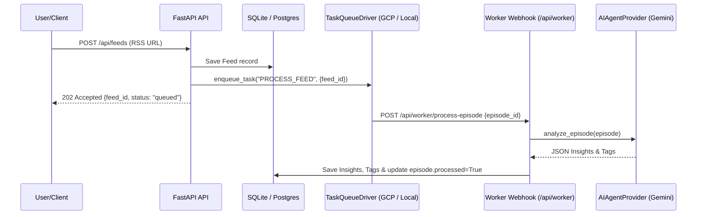

# TunedIn Backend - Feed Ingestion & Task Queue Implementation Plan

## 1. Overview
The **Feed Ingestion & Task Queue Sub-System** automates asynchronous RSS podcast feed fetching, parses audio enclosure metadata, and manages background episode processing using **Google Cloud Tasks**.

---

## 2. Key Technology & Architecture

### RSS Parsing Engine
- Uses `feedparser` and `httpx` for asynchronous HTTP feed retrieval and XML parsing.
- Extracts podcast title, author, description, cover image URL, category, episode enclosure audio URLs, published dates, and duration fields.

### Task Queue Abstraction (`TaskQueueDriver`)
- **Abstract Base Class**: `TaskQueueDriver` defining:
  - `enqueue_task(task_type: str, payload: dict) -> str`
  - `process_task(payload: dict) -> bool`
- **Primary Queue Driver (`GCPCloudTasksDriver`)**:
  - Leverages `google-cloud-tasks` SDK.
  - Constructs GCP Cloud Task HTTP requests targeting `/api/worker/process-episode` webhook.
- **Local Fallback Driver (`LocalInMemoryDriver`)**:
  - Uses Python `asyncio.Queue` worker loop to execute tasks in local background threads without GCP infrastructure for zero-config offline testing.

---

## 3. Queue Execution Workflow



---

## 4. File Structure
```
backend/app/
├── services/
│   ├── rss_service.py       # Async feedparser RSS fetching & extraction
│   └── queue/
│       ├── base.py          # TaskQueueDriver ABC
│       ├── gcp.py           # GCPCloudTasksDriver implementation
│       └── local.py         # LocalInMemoryDriver fallback
└── api/
    └── worker.py            # Task queue webhook worker endpoints
```
