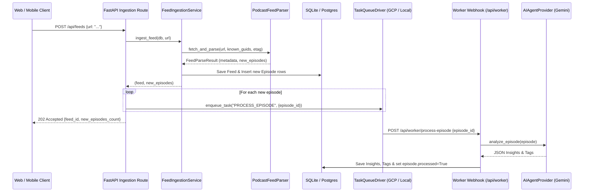

# TunedIn Backend - Feed Ingestion & Task Queue Implementation Plan

## 1. Overview
The **Feed Ingestion & Task Queue Sub-System** provides asynchronous podcast RSS feed discovery, metadata extraction, incremental episode filtering, and task queuing for background AI processing.

---

## 2. Architecture & Data Structures

### A. Parsed Data Models ([`backend/ingestion/models.py`](file:///home/xing808/dev/tunedin/backend/ingestion/models.py))

- **[`ParsedFeedMetadata`](file:///home/xing808/dev/tunedin/backend/ingestion/models.py)**:
  - `title: str`: Channel title.
  - `rss_url: str`: Canonical RSS endpoint URL.
  - `author: Optional[str]`: Podcast author / creator.
  - `description: Optional[str]`: Summary / subtitle.
  - `image_url: Optional[str]`: Feed artwork image URL (standard `<image>` or `<itunes:image>`).
  - `category: Optional[str]`: Genre / category string.
  - `link: Optional[str]`: Website link.
  - `etag: Optional[str]`: HTTP ETag header value for caching.
  - `last_modified: Optional[str]`: HTTP Last-Modified header value for caching.

- **[`ParsedEpisode`](file:///home/xing808/dev/tunedin/backend/ingestion/models.py)**:
  - `guid: str`: Unique episode identifier (fallback to audio URL or entry link).
  - `title: str`: Episode title.
  - `audio_url: str`: Media enclosure audio URL (`.mp3`, `.m4a`, etc.).
  - `duration: Optional[int]`: Normalized duration in total integer seconds (parsed from `HH:MM:SS`, `MM:SS`, or raw seconds).
  - `published_at: Optional[datetime]`: Normalized timezone-aware UTC datetime.
  - `summary: Optional[str]`: Episode description or shownotes text.
  - `enclosure_type: Optional[str]`: Audio MIME type (e.g. `audio/mpeg`, `audio/x-m4a`).
  - `link: Optional[str]`: Episode web link.

- **[`FeedParseResult`](file:///home/xing808/dev/tunedin/backend/ingestion/models.py)**:
  - `metadata: ParsedFeedMetadata`: Feed-level metadata.
  - `episodes: List[ParsedEpisode]`: List of newly parsed episodes after incremental filtering.
  - `total_feed_episodes: int`: Total number of episodes found in the RSS feed.
  - `is_not_modified: bool`: True if server returned HTTP 304 Not Modified.

---

## 3. Core Ingestion Engine

### A. Parser Engine ([`backend/ingestion/parser.py`](file:///home/xing808/dev/tunedin/backend/ingestion/parser.py))
- **`PodcastFeedParser.parse_xml_content(content, rss_url, last_updated_at=None, known_guids=None, etag=None, last_modified=None) -> FeedParseResult`**:
  - Parses raw XML string/bytes using `feedparser`.
  - Normalizes duration formats (`"01:14:22"` -> `4462`, `"45:30"` -> `2730`, `"1800"` -> `1800`).
  - Converts publication timestamps (`pubDate` / `published_parsed`) into UTC `datetime`.
  - Identifies audio enclosures across `<enclosure>`, `<media:content>`, and `<link rel="enclosure">` tags.
  - Applies incremental filters:
    - If `known_guids` is provided: skips any episode with `guid in known_guids`.
    - If `last_updated_at` is provided: skips any episode with `published_at <= last_updated_at`.
- **`PodcastFeedParser.fetch_and_parse(rss_url, last_updated_at=None, known_guids=None, etag=None, last_modified=None, client=None) -> FeedParseResult`**:
  - Asynchronously retrieves feed content via `httpx.AsyncClient`.
  - Sends conditional headers `If-None-Match` (`etag`) and `If-Modified-Since` (`last_modified`).
  - Returns empty episode list with `is_not_modified=True` upon receiving HTTP 304.

### B. Persistence Sync Service ([`backend/ingestion/service.py`](file:///home/xing808/dev/tunedin/backend/ingestion/service.py))
- **`FeedIngestionService.ingest_feed(db: AsyncSession, rss_url: str, client=None) -> tuple[Feed, List[Episode]]`**:
  - Queries existing [`Feed`](file:///home/xing808/dev/tunedin/backend/persistence/models/feed.py) and existing episode GUIDs.
  - Invokes `PodcastFeedParser` with cache headers and known GUIDs.
  - Inserts new [`Episode`](file:///home/xing808/dev/tunedin/backend/persistence/models/episode.py) records in database and updates feed metadata (`last_fetched_at`, `etag`, `last_modified`, `sync_status`).

---

## 4. Background Task Queue Workflow (Phase 2.2 Integration)



---

## 5. File Structure

```
backend/ingestion/
├── PLAN.md                   # Ingestion sub-system technical plan
├── __init__.py               # Package exports (PodcastFeedParser, ParsedEpisode, etc.)
├── models.py                 # Structured dataclasses (ParsedFeedMetadata, ParsedEpisode, FeedParseResult)
├── parser.py                 # PodcastFeedParser class with async fetch and incremental filtering
├── service.py                # Ingestion coordination service with database persistence
├── queue/                    # (Phase 2.2) TaskQueueDriver abstractions (base, GCP Cloud Tasks, local fallback)
└── tests/
    ├── __init__.py
    ├── test_parser.py        # Pytest test suite for XML parsing and incremental filters
    └── fixtures/             # Local XML feed fixtures for offline testing
        ├── sample_feed.xml
        └── sample_itunes.xml
```

---

## 6. Verification Strategy
- **Unit Tests**:
  ```bash
  .venv/bin/pytest backend/ingestion/tests/test_parser.py -v
  ```
- **Test Matrix**:
  1. `TestDurationParsing`: Tests integer, float, `"HH:MM:SS"`, `"MM:SS"` string formats.
  2. `TestFeedParser`: Validates standard RSS 2.0 and iTunes extension feeds parsing.
  3. `TestIncrementalFiltering`: Validates `last_updated_at` date boundaries and `known_guids` deduplication.
  4. `TestAsyncHttpAndCaching`: Validates HTTP 304 Not Modified behavior with mock HTTP transports.
  5. `TestIngestionService`: Validates initial ingestion and zero-duplicate re-sync with in-memory SQLite database.
