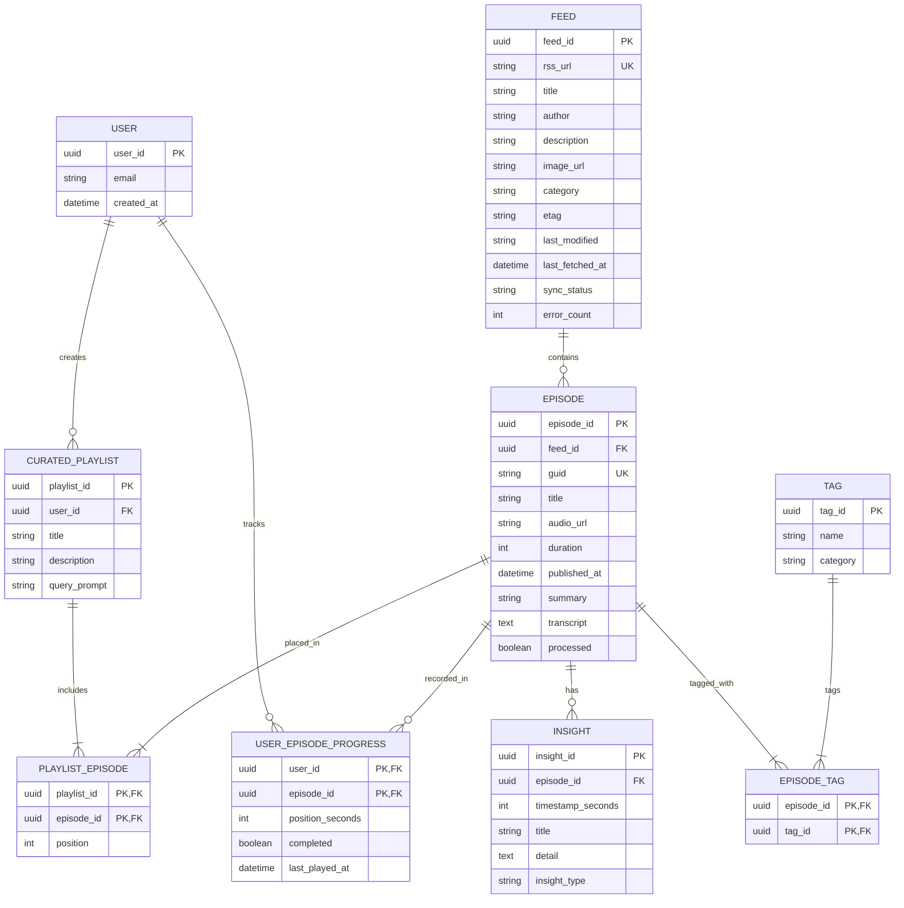

# TunedIn Backend - Persistence Layer Implementation Plan

## 1. Overview
The **Persistence Layer** provides an abstracted, async database interface for **TunedIn**. Built on SQLAlchemy 2.0 Async ORM, it defaults to **SQLite** (`sqlite+aiosqlite:///./tunedin.db`) for rapid, zero-config local development and automated testing, while supporting zero-code-change production switching to PostgreSQL / Cloud SQL via `DATABASE_URL`.

---

## 2. Technology & Architecture
- **ORM**: SQLAlchemy 2.0 (Async Engine & AsyncSession).
- **Driver Abstraction**:
  - Development / Testing: `sqlite+aiosqlite:///./tunedin.db`
  - Production Target: `postgresql+asyncpg://...`
- **Database Migrations / Schema Init**: Automatic async table creation (`Base.metadata.create_all`) on startup with seed data pipeline.

---

## 3. Explicit Data Models & Relations

All primary key IDs use explicit, entity-prefixed column names. Inter-entity join entities use composite primary keys:

- **`User`**: `user_id` (PK, UUID), `email`, `created_at`
- **`Feed`**: `feed_id` (PK, UUID), `rss_url` (UNIQUE), `title`, `author`, `description`, `image_url`, `category`, `etag`, `last_modified`, `last_fetched_at`, `sync_status`, `error_count`, `created_at`
- **`Episode`**: `episode_id` (PK, UUID), `feed_id` (FK -> `Feed.feed_id`), `guid` (INDEXED), `title`, `audio_url`, `duration`, `published_at`, `summary`, `transcript`, `processed`, `created_at` *(Unique constraint on `(feed_id, guid)`)*
- **`UserEpisodeProgress`** (Composite PK): `(user_id, episode_id)` (PK, FKs -> `User.user_id`, `Episode.episode_id`), `position_seconds` (INT), `completed` (BOOLEAN), `last_played_at` (DATETIME)
- **`Tag`**: `tag_id` (PK, UUID), `name`, `category` (topic / person / concept / industry)
- **`EpisodeTag`** (Composite PK): `(episode_id, tag_id)` (PK, FKs -> `Episode.episode_id`, `Tag.tag_id`)
- **`Insight`**: `insight_id` (PK, UUID), `episode_id` (FK -> `Episode.episode_id`), `timestamp_seconds` (INT), `title`, `detail`, `insight_type`, `created_at`
- **`CuratedPlaylist`**: `playlist_id` (PK, UUID), `user_id` (FK -> `User.user_id`), `title`, `description`, `query_prompt`, `created_at`
- **`PlaylistEpisode`** (Composite PK): `(playlist_id, episode_id)` (PK, FKs -> `CuratedPlaylist.playlist_id`, `Episode.episode_id`), `position` (INT)
- **`TaskLog`**: `task_log_id` (PK, UUID), `task_type`, `payload_json`, `status`, `error_message`, `created_at`

---

## 4. Entity Relationship Diagram



---

## 5. File Structure
```
backend/
└── persistence/
    ├── PLAN.md                  # Persistence sub-system technical plan
    ├── database.py              # Async engine setup & SessionLocal dependency
    ├── models/
    │   ├── __init__.py          # Package re-exports for Base and all models
    │   ├── base.py              # DeclarativeBase class
    │   ├── user.py              # User model
    │   ├── feed.py              # Feed model (with sync metadata)
    │   ├── episode.py           # Episode & UserEpisodeProgress models
    │   ├── tag.py               # Tag & EpisodeTag models
    │   ├── insight.py           # Insight model
    │   ├── playlist.py          # CuratedPlaylist & PlaylistEpisode models
    │   └── task_log.py          # TaskLog model
    └── tests/
        └── test_persistence.py  # Async Pytest suite for persistence layer
```
